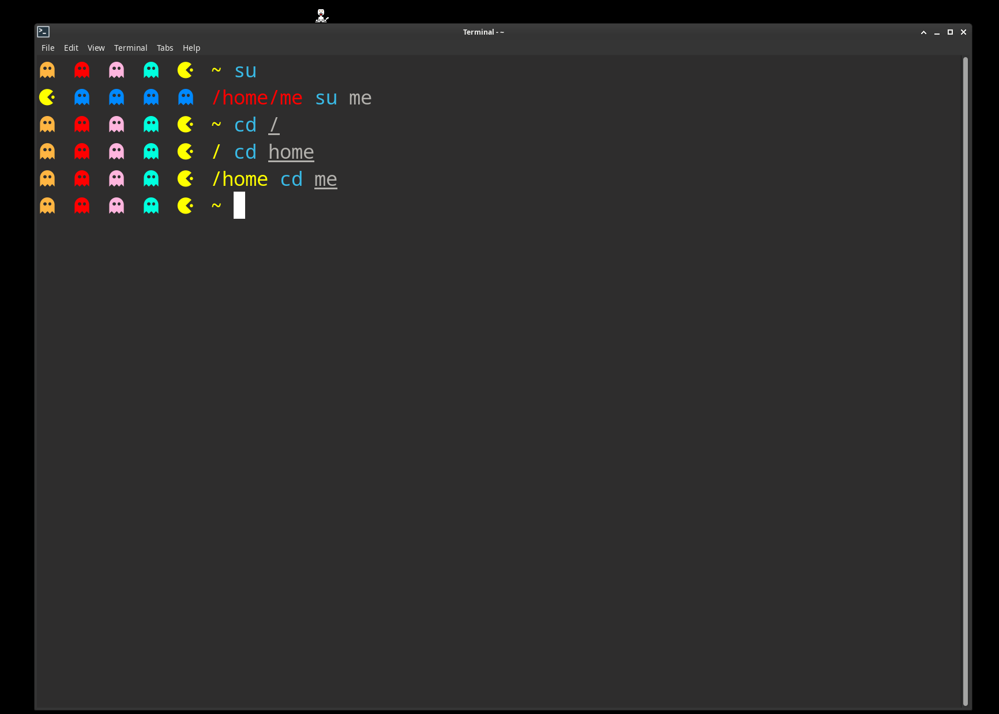

# bashrc-fish

Custom colorful Pac-Man prompt configurations for **Bash**, **Zsh**, and **Fish** shell, with distinct themes for user (`home`) and `root` sessions.



## Required Fonts & Dependencies

To display the Pac-Man icon (`󰮯`) and ghost icons (`󰊠`), you need a font with Material Design Icons / Nerd Font symbols installed:

- `ttf-material-design-icons-git` (Arch AUR)
- `ttf-material-icons-git` (Arch AUR)
- Or any modern [Nerd Font](https://www.nerdfonts.com/) (e.g. FiraCode Nerd Font, Hack Nerd Font, JetBrainsMono Nerd Font)

## Features

- **Multi-shell support**: Configurations provided for `.bashrc`, `.zshrc`, and `fish` shell.
- **Home & Root Themes**:
  - **User (`home`)**: Multi-colored ghosts (`󰊠`) following Pac-Man (`󰮯`).
  - **Root (`root`)**: Blue ghosts (`󰊠`) with Pac-Man (`󰮯`) theme for high visibility.
- **Automatic Fish Launch**: Safely transitions interactive Bash sessions into Fish shell if Fish is installed.

## Installation

You can install the configurations using the included `install.sh` script:

```bash
# Install dotfiles for current user ($HOME)
./install.sh home

# Install dotfiles for root
./install.sh root

# Install both
./install.sh all
```

### Manual Installation

#### Home User:
- Copy `bash/home/bashrc` to `~/.bashrc`
- Copy `bash/home/zshrc` to `~/.zshrc`
- Copy contents of `bash/home/fish/` to `~/.config/fish/`

#### Root User:
- Copy `bash/root/bashrc` to `/root/.bashrc`
- Copy `bash/root/zshrc` to `/root/.zshrc`
- Copy contents of `bash/root/fish/` to `/root/.config/fish/`
